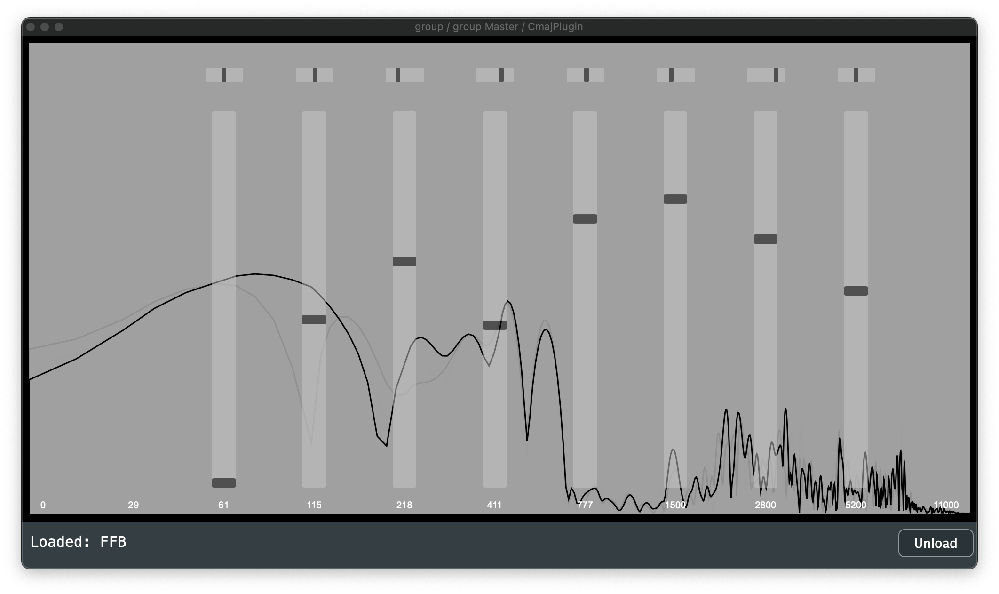

# Fixed Filter Bank

### How to run as a VST (recommended)

1. Install the Cmajor VST/AU plugin: https://github.com/cmajor-lang/cmajor/releases
2. Open your DAW and create a track with an instance of this plugin
3. Drag `FFB.cmajorpatch` onto the plugin's GUI

### How to run in VSCode

1. Install VSCode https://code.visualstudio.com/
2. Install the Cmajor VSCode plugin https://marketplace.visualstudio.com/items?itemName=CmajorSoftware.cmajor-tools
3. Open FFB.cmajor in VSCode
4. Open the VSCode command pallette `cmd-shift-P` and run the command `Cmajor: Run Patch`

### Usage

The project's GUI does not currently have controls for filter bank panning and amplitude, it simply serves as a visualizer. These controls should be exposed via the Cmajor VST/AU plugin.
